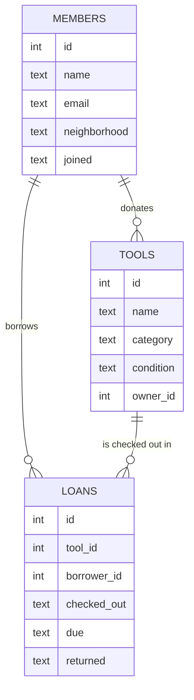

# Shed Share

A database for a neighborhood tool library: neighbors lend tools into a shared shed, and other neighbors borrow them for a few days.

## Purpose

Most apartments in a city do not have room for a drill, a ladder, and a pressure washer, and most of those tools sit unused for months. Shed Share is the record of one building’s shared shed. It answers three questions the volunteer coordinators actually ask: what do we own, who has it right now, and what is late.

The database is the system of record. A later app can sit on top of it, but the schema has to be correct before any interface exists. Coordinators today keep this information in a group chat. That chat loses the due date, disagrees about who borrowed the ladder, and cannot say how often a tool is used. The database replaces the chat for those facts.

## Scope

The first version tracks members, tools, and loans. A member is a neighbor who can borrow. A tool is a physical item in the shed, optionally donated by a member. A loan is one checkout of one tool by one member, with a due date and an optional return date.

Out of scope for this version: payments, deposits, reservations of a tool that is still on the shelf, photos, and messaging. A tool is either on the shelf or on loan. If two people want the same drill, the second person waits until the first loan is closed. That is a limitation, recorded below, not a missing table that the coordinators asked for yet.

The database is meant for one shed, on the order of a few hundred members and a few hundred tools, with a few thousand loans a year. It runs in SQLite. That is enough for a single building and keeps backups to one file.

## Entities

**Members** store the neighbor’s name, a unique email, the neighborhood (or building) they belong to, and the date they joined. Email is unique so two sign-up forms cannot create two people who are the same neighbor. The neighborhood is text rather than a separate table because this version serves one shed; if the project later covers a whole city, neighborhoods become their own table.

**Tools** store a name, a category such as “drill” or “ladder,” and a condition of excellent, good, or fair. Condition is constrained so a typo cannot create a fourth state that reports would miss. `owner_id` is nullable. A null owner means the shed itself bought the tool. A non-null owner means a member donated it and is still the person to call if it breaks. The tool does not store “who has it.” That fact changes every week and belongs on the loan.

**Loans** store which tool, which borrower, when it left, when it is due, and when it came back. `returned` is null while the tool is out. One loan is one tool. Borrowing a drill and a bit set is two loans. That keeps “what is overdue” a single join instead of a list packed into one cell.

## Relationships

A member donates zero or more tools. A tool has at most one donor. A member takes out zero or more loans. A tool is on zero or more loans over its life, but the application rule is that it has at most one open loan: a loan whose `returned` is null. The schema does not enforce that with a partial unique index in this version; the checkout query checks it. A stricter schema would add a unique index on `tool_id` filtered to open loans. SQLite supports that, and it is the first change to make if two coordinators start checking tools out at the same time.

Loans point at members and tools with foreign keys. Deleting a member who still has history is refused by the database rather than silently orphaning a loan. Tools are not deleted while an open loan exists; the sample delete in `queries.sql` checks for that.

## Entity relationship diagram

## Optimizations

The common reads are “open loans for this tool,” “open loans for this person,” and “tools in this category.” Those are covered by indexes on `loans(tool_id)`, `loans(borrower_id)`, and `tools(category)`. Primary keys already index the row lookups by id.

The `overdue` view is the report pinned on the shed door: tool name, borrower name, and due date, for loans that are still out and past due. It is a view rather than a stored table so it cannot drift from the loans. At this size the view is cheap. If the loan table grew into the millions, the next index would be a partial index on open loans only.

Dates are stored as ISO text (`YYYY-MM-DD`), which sorts correctly as text and works with SQLite’s date functions. There is no separate time of day because the shed checks tools in once each evening.

## Limitations

There is no reservation. A neighbor cannot claim a drill that is on the shelf for next Saturday. Adding that needs a reservations table with a start and end, plus a rule that a reservation cannot overlap an open loan or another reservation.

There is no fine and no deposit. Late tools show up in `overdue`, and a person decides what to do. A fines table would hang off loans and would be the place to store an amount and whether it was paid.

Condition is a label, not a history. If a drill comes back worse, someone updates the tool row and the previous condition is gone. A condition log would be the right table once coordinators care about that trail.

The one-open-loan rule is enforced by the checkout query, not by the schema. Two people using the database at once could both insert an open loan for the same tool. A partial unique index closes that.

The video overview still has to be recorded by the author of the project: title, name, GitHub and edX usernames, city, country, and the date of recording, in a video of at most three minutes. This document does not invent that recording.
